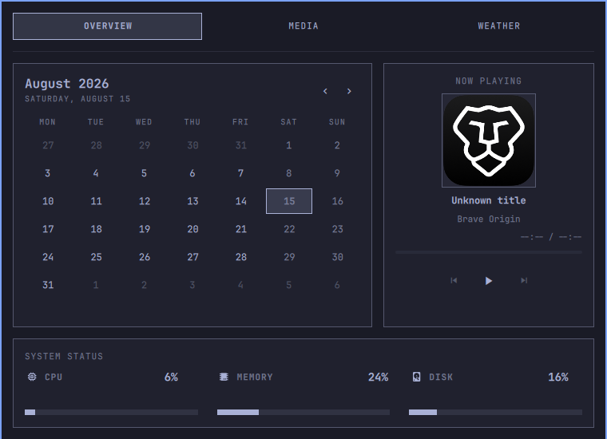

# Asked Dashboard

Omarchy Shell bar-widget, amely a középső órát egy háromnézetes dashboarddal
egészíti ki. A topbaron a nap és az idő látható, kattintásra pedig megnyílik az
Overview, Media és Weather nézet.



## Funkciók

### Topbar

- Konfigurálható nap- és időformátum.
- Bal kattintással nyitható és zárható dashboard.
- Az aktív Omarchy téma színeit, betűtípusát, térközeit és kereteit használja.
- Egyszerre csak egy példány helyezhető el a baron.

### Overview

- Havi naptár hétfői hétkezdéssel.
- Előző és következő hónap gomb.
- Mai nap kiemelése.
- Aktív MPRIS-forrás borítója, címe és előadója.
- Előző, lejátszás/szünet és következő vezérlők.
- Folyamatosan frissülő, tekerhető pozíciósáv.
- CPU-, memória- és rendszerlemez-használat.

### Media

- Nagy albumborító és részletes médiaadatok.
- Előző, lejátszás/szünet és következő vezérlők.
- 500 ms-onként frissülő, tekerhető MPRIS-pozíciósáv.
- Aktuális és teljes lejátszási idő.
- PipeWire rendszerhangerő-szabályzó.
- Több MPRIS-lejátszó esetén stabil source-választó.
- A `playerctld` proxy kiszűrése a duplikált source-ok elkerüléséhez.

### Weather

- Aktuális hőmérséklet és időjárásikon.
- Hőérzet, szélsebesség és páratartalom.
- Ötnapos előrejelzés minimum- és maximum-hőmérséklettel.
- Az Omarchy meglévő időjárás-helybeállítását használja.
- Az adatokat az Open-Meteo API szolgáltatja.

## Követelmények

- Omarchy 4 vagy újabb, az új Omarchy Shell plugin API-val.
- Quickshell MPRIS- és PipeWire-szolgáltatásokkal.
- Működő PipeWire hangrendszer a hangerőszabályzóhoz.
- `bash`, `curl`, `awk`, `df` és a Linux `/proc` fájlrendszer.
- Internetkapcsolat az időjárási adatokhoz.
- Nerd Font kompatibilis Omarchy font az ikonokhoz.

A plugin jelenleg Linux- és Omarchy-specifikus. Más Quickshell
konfigurációkban módosítás nélkül nem használható, mert a `qs.Commons` és
`qs.Ui` Omarchy komponenseire épül.

## Telepítés

### Git repositoryból

Ha a plugin külön Git repositoryban érhető el:

```bash
omarchy plugin add <repository-url> --enable --yes
```

Az Omarchy a repositoryt az alábbi helyre klónozza:

```text
~/.config/omarchy/plugins/asked.dashboard/
```

### Kézi telepítés

Helyezd a teljes plugin könyvtárat ide:

```text
~/.config/omarchy/plugins/asked.dashboard/
```

Ezután olvastasd újra és engedélyezd:

```bash
omarchy-shell shell rescanPlugins
omarchy plugin enable asked.dashboard
```

A plugin ellenőrzése:

```bash
omarchy-shell shell listPlugins
```

A listában az `asked.dashboard` bejegyzésnél az `enabled` értéknek `true`-nak
kell lennie.

## Topbar beállítása

A plugin alapértelmezett szekciója a `center`. Ha a gyári órát szeretnéd
lecserélni, a `~/.config/omarchy/shell.json` középső elrendezésében az
`omarchy.clock` bejegyzést cseréld erre:

```json
{
  "id": "asked.dashboard",
  "format": "dddd HH:mm"
}
```

Az igazítás miatt a `centerAnchor` értéke is legyen:

```json
"centerAnchor": "asked.dashboard"
```

Ne írd felül a teljes `shell.json` fájlt egy rövid példakonfigurációval. A fájl
a bar többi widgetjét, az idle időzítéseket és más pluginokat is tartalmazhat.

A Shell normál esetben automatikusan újratölti a változásokat. Ha ez nem
történik meg:

```bash
omarchy restart shell
```

## Óraformátum

A `format` mező Qt dátum- és időformátumot fogad. Példák:

| Beállítás | Példa |
|---|---|
| `dddd HH:mm` | `Saturday 12:30` |
| `ddd HH:mm` | `Sat 12:30` |
| `HH:mm` | `12:30` |
| `yyyy-MM-dd HH:mm` | `2026-08-15 12:30` |

## Használat

- Kattints a topbar órájára a dashboard nyitásához vagy bezárásához.
- Az `OVERVIEW`, `MEDIA` és `WEATHER` fülekkel válts nézetet.
- A naptár nyilaival válts hónapot.
- A média pozíciósávján kattintással vagy húzással tekerhetsz.
- A hangerősáv a PipeWire alapértelmezett kimenetének hangerejét állítja.
- Több source esetén a Media nézet tetején megjelennek a source-gombok.
- `Escape` bezárja a panelt.

A pozíciósáv csak akkor aktív, ha az adott MPRIS-lejátszó támogatja a seeket,
és közli a média teljes hosszát. Egyes élő közvetítések ezt nem támogatják.

## IPC

A dashboard közvetlenül is vezérelhető:

```bash
omarchy-shell asked.dashboard open
omarchy-shell asked.dashboard close
omarchy-shell asked.dashboard toggle
```

Ez használható Hyprland billentyűkombinációból vagy saját scriptből is.

## Időjárási hely

A plugin ezt a meglévő Omarchy állapotfájlt olvassa:

```text
~/.local/state/omarchy/settings/weather.json
```

Elvárt formátum:

```json
{
  "name": "Veszprém",
  "latitude": 47.09327,
  "longitude": 17.91149
}
```

A helyet az Omarchy időjárás-beállítójával érdemes módosítani, nem kézzel:

```bash
omarchy-weather-location --set "Budapest"
```

Az időjárás 15 percenként frissül. A plugin az alábbi Open-Meteo végpontot
használja:

```text
https://api.open-meteo.com/v1/forecast
```

## Adatforrások

| Adat | Forrás |
|---|---|
| Dátum és idő | Quickshell `SystemClock` |
| Média | `Quickshell.Services.Mpris` |
| Hangerő | `Quickshell.Services.Pipewire` |
| CPU | `/proc/stat` |
| Memória | `/proc/meminfo` |
| Lemez | `df -P /` |
| Időjárás | Open-Meteo HTTPS API |

A rendszerstatisztika három másodpercenként frissül, amíg a panel nyitva van.

## Fájlstruktúra

```text
asked.dashboard/
├── manifest.json   # Omarchy plugin metaadatok és widgetbeállítások
├── BarWidget.qml   # Topbar óra, kattintás és IPC belépési pont
├── Panel.qml       # Dashboard felület, szolgáltatások és adatlekérések
├── Model.js        # Naptár- és időjárás-segédfüggvények
└── README.md       # Dokumentáció
```

## Témázás

A plugin nem tartalmaz rögzített saját színpalettát. Az Omarchy alábbi közös
értékeit használja:

- `Color.background`, `Color.foreground`, `Color.accent`
- `Color.popups`
- `Style.font`
- `Style.spacing`
- `Style.cornerRadius`
- `Border.controlSpec`

Emiatt az Omarchy téma-, font- és skálaváltásai automatikusan megjelennek a
dashboardon.

## Jogosultságok és adatvédelem

Az Omarchy Shell pluginek nincsenek sandboxolva; a plugin QML-kódja az
`omarchy-shell` folyamatban fut. Telepítés előtt mindig nézd át a forrást.

A plugin:

- helyi rendszerstatisztikát olvas;
- a felhasználó MPRIS-lejátszóit vezérli;
- a PipeWire kimeneti hangerőt módosítja;
- az időjárási koordinátákat elküldi az Open-Meteo API-nak;
- nem használ `sudo`-t;
- nem ír saját adatbázist vagy előzményfájlt.

## Hibakeresés

### A plugin nem jelenik meg

```bash
omarchy-shell shell rescanPlugins
omarchy plugin enable asked.dashboard
omarchy restart shell
```

Ellenőrizd, hogy a könyvtár neve és a manifest azonosítója egyaránt
`asked.dashboard`.

### A panel nem nyílik meg

```bash
omarchy-shell asked.dashboard open
quickshell log --pid "$(pgrep -n quickshell)" --tail 100 --no-color
```

### Nincs médiainformáció

Ellenőrizd, hogy a lejátszó exportál-e MPRIS szolgáltatást:

```bash
busctl --user list --no-pager
```

A listában `org.mpris.MediaPlayer2.*` nevű szolgáltatásnak kell szerepelnie.

### Nem lehet tekerni

Az adott lejátszó vagy tartalom valószínűleg nem támogatja az MPRIS seek
műveletet. Ez gyakori élő közvetítéseknél és ismeretlen hosszúságú médiánál.

### Nem működik a hangerő

Ellenőrizd a PipeWire alapértelmezett kimenetét és az Omarchy saját audio
paneljét. A dashboard ugyanazt a PipeWire sinket vezérli.

### Nincs időjárás

- Ellenőrizd a `weather.json` fájlt.
- Ellenőrizd az internetkapcsolatot.
- Próbáld újra beállítani a helyet az `omarchy-weather-location` paranccsal.
- Az előző sikeres adat megmarad, ha egy frissítés átmenetileg sikertelen.

## Fejlesztés

A `~/.config/omarchy/plugins/asked.dashboard/` alatti fájlmódosításokat az
Omarchy Shell általában automatikusan észleli. Kézi újratöltés:

```bash
omarchy-shell shell rescanPlugins
```

Teljes, tiszta újraindítás:

```bash
omarchy restart shell
```

JSON és JavaScript alapellenőrzés:

```bash
jq empty manifest.json
node --check Model.js
```

Futásidejű QML hibák ellenőrzése:

```bash
quickshell log --pid "$(pgrep -n quickshell)" --tail 150 --no-color
```

## Frissítés

Gitből telepített plugin frissítése:

```bash
omarchy plugin update asked.dashboard --yes
```

Frissítés után szükség esetén:

```bash
omarchy restart shell
```

## Eltávolítás

Omarchyval telepített plugin esetén:

```bash
omarchy plugin remove asked.dashboard
```

Ha a plugin a gyári órát helyettesítette, állítsd vissza a bar
`omarchy.clock` bejegyzését és ezt az anchor értéket:

```json
"centerAnchor": "omarchy.clock"
```

## Licenc

A könyvtár jelenleg nem tartalmaz külön licencfájlt. Nyilvános terjesztés előtt
adj hozzá egy `LICENSE` fájlt, és frissítsd ezt a szakaszt a választott licenccel.
