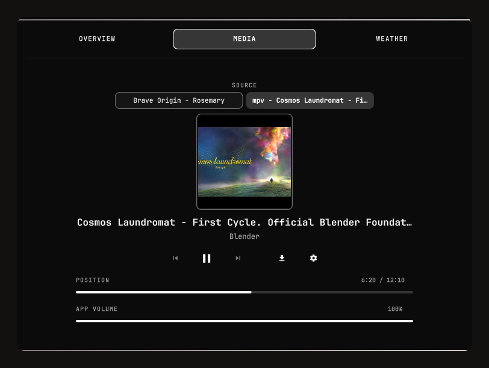
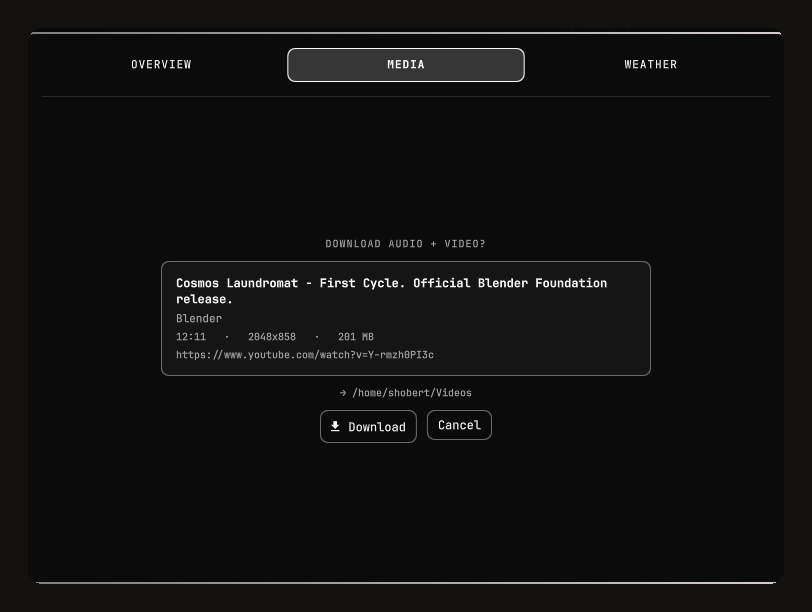
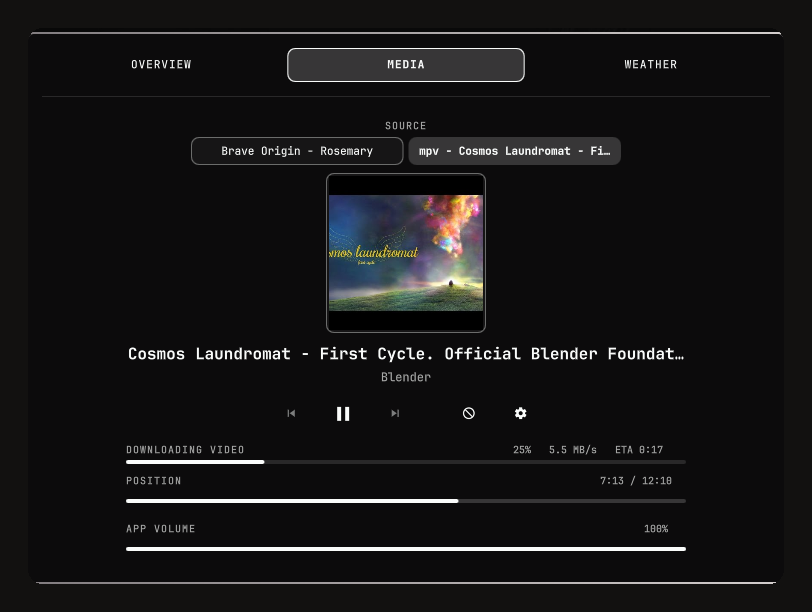
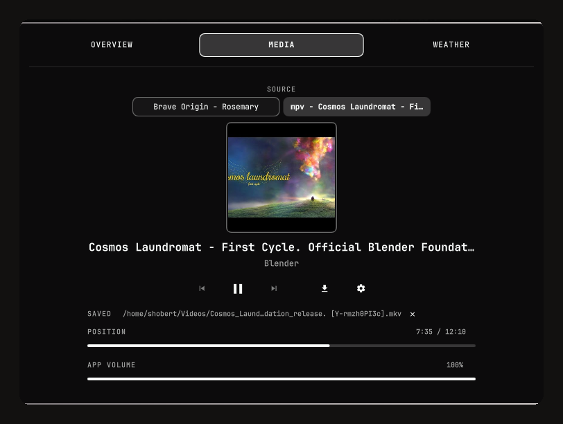
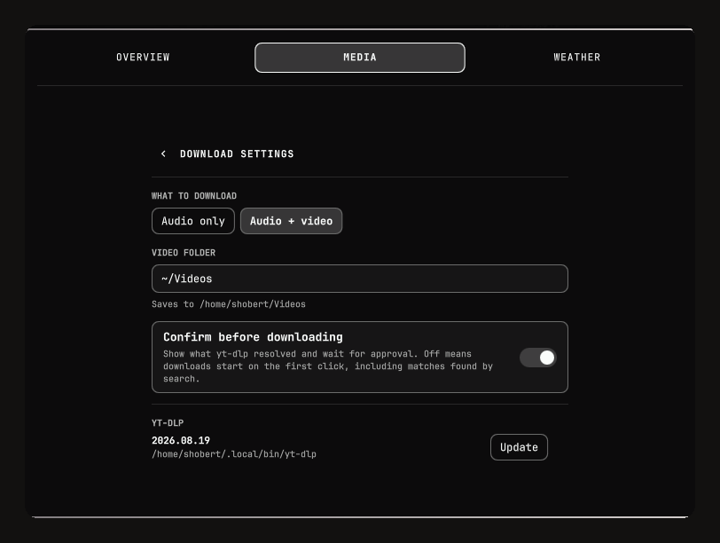

# Dashboard DL

An Omarchy Shell bar widget that extends the centered clock with a three-view
dashboard, and adds a download button to the Media view: one click fetches
whatever your active media player is playing, using `yt-dlp`.

> ### Credit
>
> **This is a fork of [Dashboard](https://github.com/cucu0628/omarchy-dashboard)
> by [cucu0628](https://github.com/cucu0628)**, used under the MIT License.
>
> The dashboard itself — the bar clock, the calendar, the Overview / Media /
> Weather views, the MPRIS transport and volume controls, the system readout and
> the weather integration — is entirely their work, and it is very good. This
> fork adds one thing: the download button described below.
>
> If you want the dashboard without the download feature, **install the original**
> — it is on the marketplace as `cucu0628.dashboard`:
>
> ```bash
> omarchy plugin add https://github.com/cucu0628/omarchy-dashboard.git --enable --yes
> ```
>
> The upstream commit history is preserved here, so `git log` still attributes
> every original commit to its author. See [NOTICE.md](NOTICE.md).


## The download button

The Media view gains a download button (`󰇚`) beside the transport controls, and
a gear for its settings. One click fetches the current track to disk.



### Working out what is playing

This is the part that is not as simple as it sounds. The plugin tries, in order:

1. **`xesam:url` from the player.** Firefox and mpv publish the real page URL.
2. **The video id recovered from the artwork URL.** mpv's `mpris:artUrl` is a
   real `i.ytimg.com/vi/<id>/` address, so the id is recoverable from it.
3. **A YouTube search on the track tags** — `ytsearch1:"artist - title"`.

Step 3 exists because **Chromium-family browsers publish no `xesam:url` at all.**
Their MPRIS bridge is fed by the Media Session API, which carries title, artist,
album and artwork, and no source URL. For Brave, Chromium and Edge the search
path is the normal case, not an edge case.

A search can resolve to a lookalike, which is why the confirmation step below is
on by default.

### Confirm before downloading

With **Confirm before downloading** enabled (the default), the plugin runs
`yt-dlp --simulate` first and shows you exactly what it resolved — title,
uploader, duration, resolution, size, the final URL and the destination folder —
before a single byte is written.



The card also warns you when the match is uncertain or unusual:

- **Found by searching** — no address came from the player, so this is a guess
  from the track tags. Check it is the right one.
- **Playlist** — the link points at a playlist; only the first item is fetched.
- **Live stream** — the download runs until you cancel it.

Turn the setting off and the first click downloads immediately, searched matches
included.

### Progress

Progress, speed and ETA are read from `yt-dlp`'s own progress output. Percent is
folded across streams, so a separate video and audio stream still reads as one
monotonic 0–100%. The button becomes a cancel button while a download runs.



When it finishes, the panel shows the path it wrote and clears itself after a few
seconds. Failures stay put until dismissed and carry `yt-dlp`'s own message.



### Settings

The gear opens the download settings.



| Setting | Default | Notes |
|---|---|---|
| What to download | `Audio + video` | Audio-only extracts best audio at quality 0; audio + video muxes into `mkv` |
| Audio folder | `~/Music` | Stored unexpanded, so it stays portable |
| Video folder | `~/Videos` | |
| Confirm before downloading | On | See above |
| yt-dlp | auto-detected | Shows the resolved binary and version (read-only) |

`mkv` rather than `mp4` is deliberate: forcing `mp4` pins h264/aac and discards
the better AV1/VP9 and Opus streams, and fixing the container afterwards would
mean re-encoding the whole file.

Settings are stored in their own state file:

```text
~/.local/state/omarchy/settings/io.github.theflngdutchman.dashboard-dl.json
```

They deliberately do **not** live on the widget's `shell.json` entry, because
disabling and re-enabling a bar widget rewrites that entry as a bare `{ id }`,
which would silently reset every preference.

### Which yt-dlp

The plugin resolves `yt-dlp` to an absolute path at load, preferring a
self-updating standalone build:

1. an explicit path, if you set one
2. `~/.local/bin/yt-dlp`
3. `~/.local/bin/yt-dlp_linux`
4. whatever `yt-dlp` resolves to on `PATH`

`PATH` is not trusted for this. The shell process can run with `/usr/bin` ahead
of `~/.local/bin`, so a bare name lookup can pick up a distribution package that
lags upstream by weeks — and **a stale `yt-dlp` is what produces YouTube's
`HTTP Error 403: Forbidden`.** The settings view shows which binary was resolved
and its version, so you can check that before blaming anything else.

**There is no in-plugin updater.** A bar widget should not be able to replace an
executable from the network on a click, so `yt-dlp -U` is not wired up: update
yt-dlp with whatever installed it. The settings view is read-only about the
binary — it shows the resolved path and version so a stale build is visible
without leaving the panel.

### What it will not do

- **Local files.** Nothing to fetch.
- **Anything that is not a public address.** The URL is parsed strictly and the
  host is checked against loopback, RFC1918, link-local (including
  `169.254.169.254`), CGNAT/tailnet `100.64.0.0/10`, IPv6 loopback/ULA/link-local,
  multicast, bare hostnames, and `.local` / `.internal` / `.home.arpa` names.
  IPv4 written in decimal, octal or hex is normalised first, and a URL carrying
  userinfo (`http://youtube.com@10.0.0.1/`) is refused outright. Anything that
  does not parse cleanly is refused rather than guessed at.
- **DRM services.** Spotify, Tidal, Deezer and Amazon Music hand over
  well-formed URLs that `yt-dlp` refuses outright, so these are rerouted to a
  tag search instead of failing. `yt-dlp` owns the authoritative blocklist; its
  stderr is surfaced verbatim for anything this plugin does not know about.
- **Whole playlists.** A playlist link fetches its first item only.

## Features

Everything in this section apart from **Download** comes from
[the original plugin](https://github.com/cucu0628/omarchy-dashboard).

### Top bar

- Configurable day and time format.
- Open or close the dashboard with a left click.
- Uses the active Omarchy theme colors, font, spacing, and borders.
- Only one widget instance can be placed on the bar.

### Overview

- Monthly calendar with Monday as the first day of the week.
- Previous and next month controls.
- Highlight for the current day.
- Cover art, title, and artist from the active MPRIS source.
- Previous, play/pause, and next controls.
- Continuously updated, seekable playback progress bar.
- CPU, memory, and root disk usage.

### Media

- Large cover art and detailed media metadata.
- Previous, play/pause, and next controls.
- MPRIS playback position updated every 500 ms.
- Current and total playback time.
- Seekable playback progress bar.
- Per-player MPRIS volume control for the selected media source.
- Source selector when multiple MPRIS players are available.
- Filters the `playerctld` proxy to avoid duplicate sources.
- **Download the current track with `yt-dlp`.** ← added by this fork

### Weather

- Current temperature and weather icon.
- Apparent temperature, wind speed, and humidity.
- Five-day forecast with minimum and maximum temperatures.
- Uses the existing Omarchy weather location setting.
- Fetches data from the Open-Meteo API.

## Requirements

- Omarchy 4 or newer with the current Omarchy Shell plugin API.
- Quickshell with MPRIS support.
- `bash`, `curl`, `awk`, `df`, and the Linux `/proc` filesystem.
- An internet connection for weather data.
- An Omarchy Nerd Font-compatible font for icons.
- **[`yt-dlp`](https://github.com/yt-dlp/yt-dlp) for the download feature.**
  Optional — the rest of the dashboard works without it. A self-updating
  standalone build is strongly preferred:

  Prefer your distribution's package. If you install the standalone build
  instead, pin a release and verify it — `releases/latest` is a mutable pointer,
  and an unverified binary is an unreviewed one:

  ```bash
  VERSION=2026.08.19
  SHA256=58162f9bfdc27458ea47bfcb311cf47028f17d8154a8bf7d689861d46399230a

  curl -fL --proto '=https' \
    "https://github.com/yt-dlp/yt-dlp/releases/download/${VERSION}/yt-dlp_linux" \
    -o /tmp/yt-dlp_linux
  echo "${SHA256}  /tmp/yt-dlp_linux" | sha256sum -c - \
    && install -m755 /tmp/yt-dlp_linux ~/.local/bin/yt-dlp
  ```

  Check the current version and its checksum against
  [yt-dlp's releases](https://github.com/yt-dlp/yt-dlp/releases) — every release
  publishes a `SHA2-256SUMS` file.

  `ffmpeg` is also needed for audio extraction and for muxing separate video and
  audio streams.

This plugin is Linux- and Omarchy-specific. It cannot be used unchanged in an
unrelated Quickshell configuration because it depends on Omarchy's `qs.Commons`
and `qs.Ui` components.

## Installation

### From a Git repository

```bash
omarchy plugin add https://github.com/TheFlngDutchman/omarchy-dashboard-dl.git --enable --yes
```

Omarchy clones the repository into:

```text
~/.config/omarchy/plugins/io.github.theflngdutchman.dashboard-dl/
```

### Manual installation

Place the complete plugin directory at:

```text
~/.config/omarchy/plugins/io.github.theflngdutchman.dashboard-dl/
```

Then rescan and enable it:

```bash
omarchy-shell shell rescanPlugins
omarchy plugin enable io.github.theflngdutchman.dashboard-dl
```

Verify the installation with:

```bash
omarchy-shell shell listPlugins
```

The `io.github.theflngdutchman.dashboard-dl` entry should have `enabled` set to
`true`.

### Migrating from the original Dashboard

The two plugins have different IDs, so they can be installed side by side — but
only one may sit on the bar, and their settings do not carry over. To switch,
remove the original first:

```bash
omarchy plugin remove cucu0628.dashboard
```

Then replace its `shell.json` entry as described below.

## Top bar configuration

The default section is `center`. To replace the stock clock, replace the
`omarchy.clock` entry in the center layout of `~/.config/omarchy/shell.json`
with:

```json
{
  "id": "io.github.theflngdutchman.dashboard-dl",
  "format": "dddd HH:mm"
}
```

Set `centerAnchor` to the dashboard as well:

```json
"centerAnchor": "io.github.theflngdutchman.dashboard-dl"
```

Do not replace your entire `shell.json` with a short example. That file may also
contain the rest of your bar layout, idle timers, and other plugins.

The Shell normally reloads configuration changes automatically. If it does not,
run:

```bash
omarchy restart shell
```

## Clock format

The `format` setting accepts a Qt date and time format.

| Setting | Example |
|---|---|
| `dddd HH:mm` | `Saturday 12:30` |
| `ddd HH:mm` | `Sat 12:30` |
| `HH:mm` | `12:30` |
| `yyyy-MM-dd HH:mm` | `2026-08-15 12:30` |

## Usage

- Click the clock on the top bar to open or close the dashboard.
- Use the `OVERVIEW`, `MEDIA`, and `WEATHER` tabs to switch views.
- Use the calendar arrows to change the displayed month.
- Click or drag a playback progress bar to seek.
- The volume bar controls the selected MPRIS player's own volume.
- When multiple players are active, source buttons appear at the top of the
  Media view. The download button follows the selected source.
- Press `Escape` to close the panel.

The playback progress bar is enabled only when the selected MPRIS player
supports seeking and reports the total media length. Some live streams do not
provide these capabilities.

## IPC

The dashboard can also be controlled directly:

```bash
omarchy-shell io.github.theflngdutchman.dashboard-dl open
omarchy-shell io.github.theflngdutchman.dashboard-dl close
omarchy-shell io.github.theflngdutchman.dashboard-dl toggle
```

These commands can be used from scripts or Hyprland keybindings.

## Weather location

The plugin reads the existing Omarchy weather state file:

```text
~/.local/state/omarchy/settings/weather.json
```

Expected format:

```json
{
  "name": "Veszprem",
  "latitude": 47.09327,
  "longitude": 17.91149
}
```

Use the Omarchy weather location tool instead of editing the file manually:

```bash
omarchy-weather-location --set "Budapest"
```

Weather data refreshes every 15 minutes. The plugin uses this Open-Meteo
endpoint:

```text
https://api.open-meteo.com/v1/forecast
```

## Data sources

| Data | Source |
|---|---|
| Date and time | Quickshell `SystemClock` |
| Media | `Quickshell.Services.Mpris` |
| Application volume | Selected MPRIS player's `volume` property |
| CPU | `/proc/stat` |
| Memory | `/proc/meminfo` |
| Disk | `df -P /` |
| Weather | Open-Meteo HTTPS API |
| Downloads | `yt-dlp`, run as an external process |

System statistics refresh every three seconds while the panel is open.

## File structure

```text
io.github.theflngdutchman.dashboard-dl/
├── manifest.json   # Omarchy plugin metadata and widget settings
├── BarWidget.qml   # Top-bar clock, click handling, and IPC entry point
├── Panel.qml       # Dashboard UI, services, and data collection
├── Download.qml    # yt-dlp engine behind the Media view download button
├── Model.js        # Calendar and weather helper functions
├── preview.png     # Marketplace and README preview image
├── screenshots/    # README screenshots
├── LICENSE         # MIT license
├── NOTICE.md       # Upstream attribution and third-party notices
└── README.md       # Documentation
```

## Theming

The plugin does not define a fixed color palette. It uses the following shared
Omarchy values:

- `Color.background`, `Color.foreground`, and `Color.accent`
- `Color.popups`
- `Style.font`
- `Style.spacing`
- `Style.cornerRadius`
- `Border.controlSpec`

As a result, Omarchy theme, font, and scaling changes are reflected in the
dashboard automatically.

## Permissions and privacy

Omarchy Shell plugins are not sandboxed. Their QML code runs inside the
`omarchy-shell` process. Always review a plugin before installing it.

This plugin:

- reads local system statistics;
- controls MPRIS players owned by the current user;
- changes the selected MPRIS player's own volume;
- sends the configured weather coordinates to Open-Meteo;
- **runs `yt-dlp` as an external process when you press the download button, and
  writes files to the folder you configure;**
- **sends the resolved URL, or a search query built from the current track's
  title and artist, to whatever site `yt-dlp` contacts;**
- does not request elevated privileges;
- does not maintain its own database or history file.

Downloads only ever start from an explicit button press. Nothing is fetched in
the background, and no telemetry is collected.

Process arguments are passed in array form and terminated with `--`, so quotes,
spaces, semicolons and leading dashes in a URL or folder name are inert data
rather than shell syntax. This matters because the URL comes from metadata that a
web page controls.

### Bounds on untrusted input

Everything below the button press treats player metadata and `yt-dlp` output as
hostile, because a web page writes the first and a remote site writes the second.

- **Arguments** are passed in array form and terminated with `--` (above). No
  shell is re-entered anywhere in the download path.
- **Addresses** are parsed strictly and must resolve to a public host — see
  [What it will not do](#what-it-will-not-do). The same check is applied again to
  the URL actually handed to `yt-dlp`, because after a probe that URL is
  `yt-dlp`'s own `webpage_url`, which the remote page controls.
- **Runtime** is bounded on the producing side: every child runs under
  `timeout -k 5`, so a hung or hostile endpoint cannot pin a process inside the
  long-running shell. Nothing relies on the plugin noticing.
- **Output** is truncated before it is stored or rendered — per probe field, per
  progress line, and per error message.
- **Rendering** forces `Text.PlainText` on every component that displays this
  data. Qt's default `AutoText` would sniff a title like
  `` as rich text and fetch it.
- **The weather fetch** is capped with `--max-time`, `--max-filesize`,
  `--proto '=https'` and `--no-location`.
- **The settings file** is size-capped before parsing, type-checked per key,
  string-clamped, and limited in how many unknown keys it round-trips. Writes go
  through `FileView`'s `atomicWrites` (temp file plus rename).

Two gaps are worth stating rather than papering over:

- A **public hostname that resolves to a private address** (DNS rebinding) is not
  detectable here — QML cannot resolve names, so the policy applies to the
  literal host only.
- **`yt-dlp` follows redirects internally**, so a public URL that redirects to a
  private one is not seen by this plugin.

Both are bounded by the fact that a download only ever starts from an explicit
press on a track you are already playing.

## Troubleshooting

### The plugin does not appear

```bash
omarchy-shell shell rescanPlugins
omarchy plugin enable io.github.theflngdutchman.dashboard-dl
omarchy restart shell
```

Ensure that both the directory name and the manifest ID are
`io.github.theflngdutchman.dashboard-dl`.

### The panel does not open

```bash
omarchy-shell io.github.theflngdutchman.dashboard-dl open
quickshell log --pid "$(pgrep -n quickshell)" --tail 100 --no-color
```

### No media information is shown

Check whether the player exports an MPRIS service:

```bash
busctl --user list --no-pager
```

The output should contain a service named `org.mpris.MediaPlayer2.*`.

### The download button is disabled

Hover it — the tooltip says why. Common reasons: nothing is playing, the source
is a local file, or the player exposes no usable track information.

### Downloads fail with `HTTP Error 403: Forbidden`

Almost always a stale `yt-dlp`. Open the download settings and check the version
and the resolved path, then update that binary through whatever installed it —
your package manager, or a fresh verified download (see
[Requirements](#requirements)). The plugin will not update it for you.

### The download grabbed the wrong video

Your player published no URL, so the plugin searched on the track tags and the
search returned a lookalike. Keep **Confirm before downloading** on: the
confirmation card labels searched matches explicitly and shows the resolved
title and URL before anything is written.

### Seeking is disabled

The selected player or content probably does not support the MPRIS seek
operation. This is common for live streams and media with an unknown length.

### Volume control does not work

Confirm that the selected player exports the MPRIS `volume` property. The slider
is disabled when the application does not support MPRIS volume control.

### Weather is missing

- Check the `weather.json` state file.
- Check your internet connection.
- Configure the location again with `omarchy-weather-location`.
- Previously loaded weather data remains visible if a refresh fails temporarily.

## Development

Editing a file under
`~/.config/omarchy/plugins/io.github.theflngdutchman.dashboard-dl/` fires the
plugin reload watch, but **that only re-instantiates the manifest's
`entryPoints.barWidget` file** — `BarWidget.qml`. `Panel.qml` and `Download.qml`
are pulled in through a `Loader` and are served from the compiled-component
cache, so they are **not** re-parsed.

This makes "I saved the file and saw no QML errors" a false negative: the new
code was never compiled. After editing anything other than `BarWidget.qml`, run:

```bash
omarchy restart shell
```

and confirm a new PID before believing any log- or screenshot-based check:

```bash
pgrep -af "quickshell -n -p"
```

Basic JSON and JavaScript validation:

```bash
jq empty manifest.json
node --check Model.js
omarchy plugin validate .
```

Check runtime QML errors with:

```bash
quickshell log --pid "$(pgrep -n quickshell)" --tail 150 --no-color
```

## Updating

To update a Git-managed installation:

```bash
omarchy plugin update io.github.theflngdutchman.dashboard-dl --yes
```

If necessary, restart the Shell afterward:

```bash
omarchy restart shell
```

## Removal

For an Omarchy-managed installation:

```bash
omarchy plugin remove io.github.theflngdutchman.dashboard-dl
```

If the dashboard replaced the stock clock, restore the `omarchy.clock` entry and
set:

```json
"centerAnchor": "omarchy.clock"
```

Downloaded files are left alone. The settings file is not removed automatically:

```bash
rm ~/.local/state/omarchy/settings/io.github.theflngdutchman.dashboard-dl.json
```

## Credits

- **[cucu0628](https://github.com/cucu0628)** — the original
  [Dashboard](https://github.com/cucu0628/omarchy-dashboard) plugin, which is
  the whole of this one apart from the download button.
- **[yt-dlp](https://github.com/yt-dlp/yt-dlp)** — the download engine.
- **[Open-Meteo](https://open-meteo.com/)** — weather data.
- Screenshots show *Cosmos Laundromat - First Cycle*, a Blender Foundation open
  movie under [CC BY 3.0](https://creativecommons.org/licenses/by/3.0/).

## License

MIT, as inherited from the original plugin. See [LICENSE](LICENSE) for the full
text and [NOTICE.md](NOTICE.md) for attribution.
